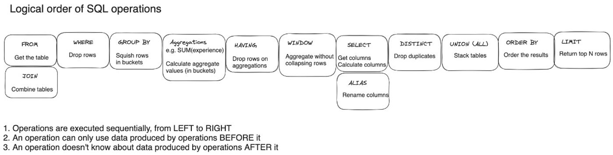

# Essential SQL Concepts

## How Data is Organized in SQL

* Tables, rows, columns, primary keys, etc.
* Understand the basic structure of a relational database

## The SQL Statement

* Lexical order of SQL Clauses when writing.
* `SELECT ... FROM ... WHERE ... GROUP BY ... HAVING ... ORDER BY ...`
* Understand the basic components of a SQL query

## The Order of SQL Operations

1. `FROM`
2. `WHERE`
3. `GROUP BY`
4. `HAVING`
5. `SELECT`
6. `ORDER BY`

* Understand the order in which SQL operations are performed.