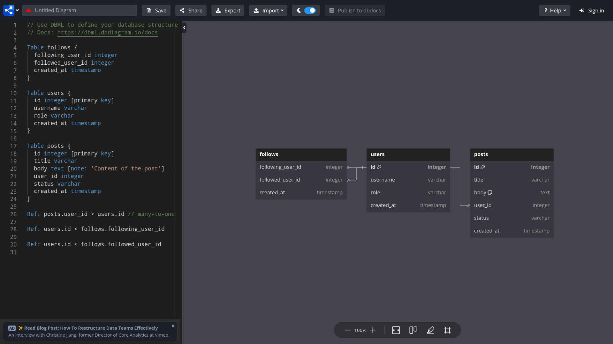

GoogleSQL (Bigquery) Script

## Joins in SQL

- Joins are used to combine (or join) two or more tables based on a "common" column 
- There are many types of Joins, we'll learn most of them!
- Join is used whenever we require data that isn't present in a single database table, so we combine multiple tables to create our desired data table.


---

### A. Inner Join

- It joins the rows that are common (obeys the join condition) in both tables! (like set intersection)

#### 1. Find out what distinct items are in the inventory of individual characters.

- Clearly, we need to access both tables "inventory and character" to answer the question!
- Here, we will use only "JOIN", Bigquery will default it to the "Inner Join".

```sql
SELECT
  char.id, -- table name is always required when column names are ambiguous.
  char.name,
  inventory.item_id,
  it.name AS item_name,
  it.power,
  quantity
FROM fantasy_dataset.character char -- can also use aliases for tables. (Optional "AS")
JOIN fantasy_dataset.inventory -- Performs "Inner join"
ON char.id = inventory.character_id -- Joins on common columns. (logically connected)

-- Again joining (multiple tables) (table from above JOIN Clause + below table)
JOIN fantasy_dataset.items it
ON inventory.item_id = it.id

ORDER BY char.id, quantity;
```

### B. Self Join

- Self Join is a special case of a simple join, it links a table to itself.
- When we have to join a table to itself due to some logical connection, we use "Self Join". Let's see:

#### 1. List all the characters with their mentor names (if applicable).

- Characters and mentors are stored in the same table "character", so self join is applicable!

```sql
SELECT
  chars.name as character_name,
  mentor.name as mentor_name
FROM fantasy_dataset.character chars
JOIN fantasy_dataset.character mentor -- Joining with the same table! 
ON chars.mentor_id = mentor.id; -- with different aliases.
```

### Flexibility of Join Conditions

- "Joins" are so flexible, we can combine tables based on complex conditions!! (rather than simple equality).

#### Example

- A character can use any item for which the power level is equal or greater than the character's experience divided by 100
- Find a list of all characters & the items they can use!

```sql
SELECT
  char.name,
  experience/100 as calc_experience,
  it.name as item_name,
  it.power
FROM fantasy_dataset.character  char
JOIN fantasy_dataset.items AS it
ON char.experience/100 <= it.power -- We can use any "boolean algebra" here, like (A OR B AND C)
ORDER BY char.name;
```

- Detailed explanation of 7 types of SQL Joins: **[See Here](https://learnsql.com/blog/sql-join-examples-with-explanations/)**

### C. LEFT JOIN & RIGHT JOIN

- In "LEFT JOIN", we do the same as before, just here we must take all the rows from the "LEFT" Table, even if they don't have a match, "RIGHT" table columns are filled with NULL values!
  
#### 1. Selecting all characters and their mentors, even if they don't have a mentor!!

```sql
SELECT chars.name as Character, mentors.name as Mentor
FROM fantasy_dataset.character as chars
LEFT JOIN fantasy_dataset.character as mentors -- Performing Left Join!
ON chars.mentor_id = mentors.id;
```

- Similarly, in "Right Join", we must take all the rows from the "RIGHT" table!

#### 2. Selecting all mentors even if they don't have a mentee (Considering all characters as mentors)!

```sql
SELECT STRING_AGG(chars.name, ", ") as Mentee, mentors.name as Mentor
FROM fantasy_dataset.character as chars
RIGHT JOIN fantasy_dataset.character as mentors -- Right Join!
ON chars.mentor_id = mentors.id
GROUP BY mentors.name;
```

### D. Full Outer Join

- "Full Outer Join" combines the entire data from both tables, selecting the common rows (intersection) between tables only once!
- It selects common rows between the tables once and distinct rows in both tables!

```sql
SELECT char.name as name, items.item_type as item_type, items.name as item_name, invent.is_equipped as is_equipped
FROM fantasy_dataset.character char
FULL OUTER JOIN fantasy_dataset.inventory invent -- Joining all the rows with Full outer join.
ON char.id = invent.character_id
FULL OUTER JOIN fantasy_dataset.items items -- join multiple tables.
ON invent.item_id = items.id;
```

### E. EXCLUSIVE LEFT, RIGHT Joins & EXCLUSIVE FULL JOIN

- Exclusive means dropping the rows that are common in both tables & keeping everything else as we've learned!
- Exclusive Left & Right Join is like a set difference.
- Exclusive Full Join means dropping the common rows, only taking distinct rows from both tables!
- Code for Exclusive joins is easy, and is given in the joins image above!

---

There is a SQL joins visualization tool, handy to learn intuitively: **[SQL Joins Visualization Tool](https://sql-joins.leopard.in.ua/)**

Joining on common columns is often performed on tables connected via foreign keys!

This website helps to design database schemas, connections, etc.: **[Database Diagram Tool](https://dbdiagram.io/d)**

