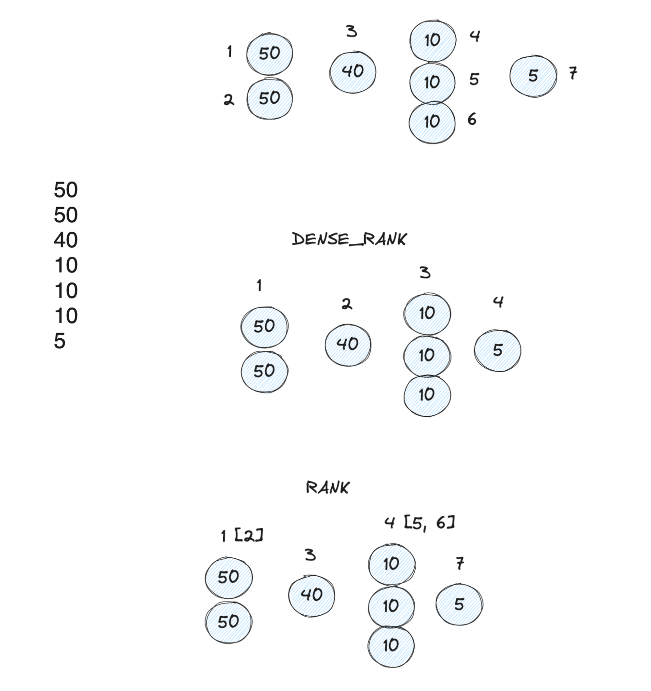

GoogleSQL (Bigquery) Script

## Aggregations in SQL

Aggregation in data refers to the process of combining multiple data points into a single value. In SQL, aggregation is used to perform calculations on a set of rows and return a single output. Common SQL aggregation functions are `SUM`, `AVG`, `MAX`, `MIN`, and `COUNT`.

We've seen common aggregations on entire data using these functions! Now, we'll perform aggregations on specific groups of data using the `GROUP BY` clause.

### A. GROUP BY

- Aggregation is often used with the `GROUP BY` clause to group data by one or more columns and perform calculations on each group.
- It's handy in many common business problems as it squishes rows into buckets.

#### 1. What are the average level measures by class of characters?

- Averaging the level by class:

```sql
SELECT ROUND(AVG(level), 3) AS Average, class 
FROM fantasy_dataset.character
GROUP BY class; -- Creating groups by class!
```

- You can also group by multiple fields:

#### 2. Average power by item type & rarity combination:

```sql
SELECT  item_type, rarity, AVG(power) AS avg_power
FROM fantasy_dataset.items
GROUP BY item_type, rarity
ORDER BY 1,2; -- can use column numbers
```

- **Law of Grouping**: After grouping, you can only select:
  1. Grouping Fields (Columns that are listed in `GROUP BY`)
  2. Aggregations of other fields.

- However, the above law is an exception as shown below:

```sql
SELECT name, class, AVG(experience) AS avg_exp, is_alive, guild
FROM fantasy_dataset.character
GROUP BY GROUPING SETS (
  (class),  -- Group by class only
  (name),  -- Group by name only
  (is_alive, guild)  -- Group by both is_alive & guild
) ORDER BY avg_exp;
```

### B. HAVING Clause

- `HAVING` is used to filter groups created by `GROUP BY`. 
- You can apply any boolean condition to drop/filter the groups/buckets.

#### 1. List all character classes with average experience above 7000:

```sql
SELECT class, AVG(experience) as avg_experience
FROM fantasy_dataset.character
GROUP BY class
HAVING avg_experience > 7000; -- Dropping groups having experience <= 7000
```

### C. WINDOW Functions in SQL

Window functions perform calculations across a set of rows, known as a "window", that are related to the current row. They allow you to:

- Calculate aggregations (e.g., `SUM`, `AVG`) over a window.
- Rank rows within a window.
- Access data from previous or next rows within a window.

Unlike group by aggregations, which collapse multiple rows into a single row, window functions do not collapse rows. Instead, they return a value for each row in the result set, based on the calculation performed over the window. 

A "window" is defined by the `OVER()` clause, used for calculations like aggregations, rankings, and accessing neighboring rows.

#### 1. OVER()

- Using the entire table as a window, then performing aggregating functions on it!

```sql
-- Show each item in the items table, with a "total sum of power" & what % of total power that item holds.
SELECT
  name, item_type,
  `power`, SUM(`power`) OVER() AS total_power_sum, -- Sum (aggregating) over the entire table, no-row collapsed!
  ROUND(`power`/SUM(`power`) OVER() * 100, 2) AS percent_total_power -- Shared power  
FROM fantasy_dataset.items;
```

#### 2. OVER(PARTITION BY col)

- Using partitions to perform aggregating functions separately within each group defined by the column.

```sql
-- Show each item in the items table, along with the total sum of power for its item_type and the percentage of the item's power relative to its item_type.
SELECT
  name, item_type, power,
  SUM(power) OVER (PARTITION BY item_type) as total_power_by_type, -- Sum of power within each item_type (Window)
  ROUND(power/SUM(power) OVER (PARTITION BY item_type) * 100, 2) AS percent_power_by_type -- Percentage of power within item_type
FROM fantasy_dataset.items;
```

#### 3. OVER(ORDER BY col)

- Using ordering to perform calculations that depend on the sequence of rows, such as running totals or rankings.

```sql
-- List all items with their cumulative power ordered by power ascending.
SELECT
  name, item_type, `power`, -- wrap `col` to avoid name clashes.
  SUM(`power`) OVER(ORDER BY `power`) AS cumulative_power -- Running total of power ordered by power value
FROM fantasy_dataset.items;
```
#### 4. OVER(PARTITION BY col ORDER BY col2)

- Combining partitioning and ordering to perform calculations like running totals or rankings within each group. 

```sql
-- Show each item with its cumulative power within each item_type, ordered by power ascending.

SELECT
  name, item_type, power,
  SUM(`power`) OVER(
    PARTITION BY item_type ORDER BY `power`
  ) AS cumulative_power_by_type, -- Running total of power within each item_type
  ROW_NUMBER() OVER(PARTITION BY item_type ORDER BY power) AS power_rank_by_type -- Rank of each item within item_type based on power
FROM
  fantasy_dataset.items;
```

- As usual, multiple columns can be used with `PARTITION BY` & `ORDER BY` when using a window function!

### D. Numbering Functions in SQL

Number functions in SQL window functions are used to generate specific types of numeric values over a window of rows such as `RANK`, `DENSE_RANK`, `ROW_NUMBER`, `NTILE`, etc.

- **`ROW_NUMBER()`**: Assigns a unique sequential integer to rows, starting from 1 for the first row in each partition.

- **`RANK()`**: Assigns a rank to each row, with the same rank given to rows with equal values, but leaves gaps in the ranking for ties (e.g., 1, 2, 3, 3, 5, 6).

- **`DENSE_RANK()`**: Similar to `RANK()`, but does not leave gaps in the ranking for ties (e.g., 1, 2, 3, 3, 4, 5).

- **`NTILE(n)`**: Divides the rows in the partition/window into `n` buckets and assigns a bucket number to each row.

```sql
SELECT
  name, item_type, weight, 
  ROW_NUMBER() OVER(ORDER BY weight) as row_num,
  RANK() OVER(ORDER BY weight) as rank, -- obviously, we can use any window (PARTITION BY) here!
  DENSE_RANK() OVER(ORDER BY weight) as rank_dense,
  NTILE(17) OVER(ORDER BY weight) as bucket_num
FROM fantasy_dataset.items
ORDER BY weight;
```

Behaviour of **Numbering Window Functions :**




