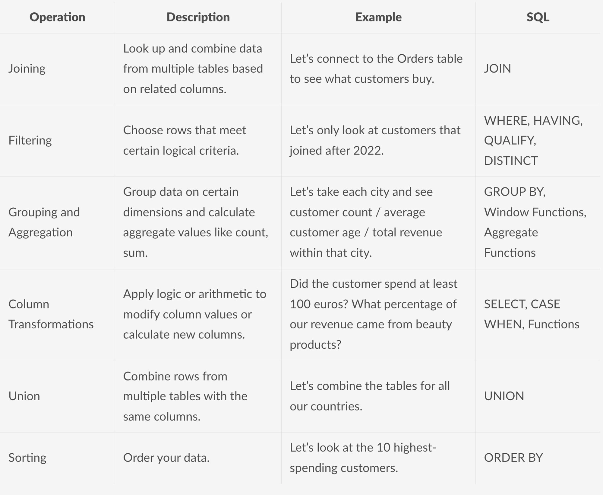

# Putting it all together !

As we have learned the most used individual components of **SQL**, it is the time for practice, and learning to use them in complex problems! 

We'll do a few exercises from now, that will be placed [here](./exercises.md) as markdown!

## Here is a summary of the concepts we learned till now, use it as a reference!

